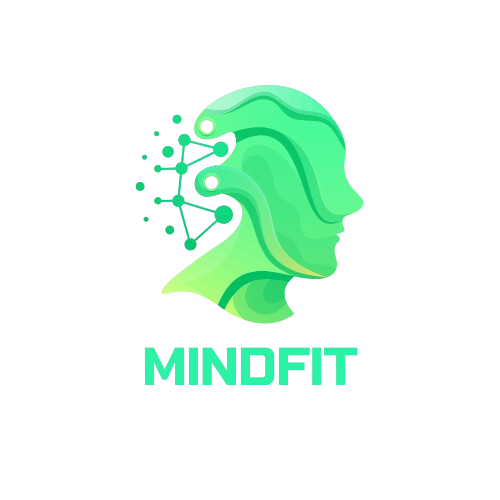

# Mindfit



**Mindfit** é um aplicativo Android desenvolvido para promover saúde física, mental e bem-estar, alinhado à visão da Sociedade 5.0. Utilizando inteligência artificial e integração com dispositivos vestíveis, o Mindfit oferece uma experiência personalizada, com foco em atividade física, nutrição e equilíbrio emocional. Esta é a implementação inicial do projeto, desenvolvida como parte da Fase 3 do curso de Sistemas de Informação da FIAP.

## Visão Geral
O Mindfit visa preencher lacunas no mercado de saúde digital, oferecendo uma plataforma que combina dados fisiológicos, psicológicos e contextuais para criar recomendações personalizadas. Diferentemente de concorrentes como MyFitnessPal e Fitbit, o Mindfit destaca-se pela personalização avançada via inteligência artificial e um chatbot interativo que fornece suporte motivacional e técnico.

### Funcionalidades Implementadas
- **Tela de Introdução (Splash Screen)**: Exibe o logotipo do aplicativo e direciona o usuário para a tela de login.
- **Tela de Login e Cadastro**: Suporta autenticação via e-mail/senha e login social (Google e Facebook, em desenvolvimento).
- **Tela Principal de Acompanhamento (Dashboard)**: Exibe resumo de calorias, atividades físicas, indicadores de bem-estar e progresso, com navegação para outras seções.
- **Tela de Planejamento de Treinos**: Apresenta rotinas de exercícios personalizadas baseadas em objetivos e nível de condicionamento.
- **Tela de Acompanhamento Nutricional**: Permite registro de refeições, com suporte futuro para identificação de alimentos via câmera.

## Tecnologias Utilizadas
- **Linguagem**: Kotlin
- **IDE**: Android Studio
- **Layout**: ConstraintLayout, Material Design Components
- **Versionamento**: Git e GitHub
- **Design de Interface**: Wireframes criados com ferramentas de UX/UI
- **Padrões de Acessibilidade**: Conformidade com WCAG

## Estrutura do Projeto
O projeto segue uma arquitetura modular com Activities independentes, facilitando manutenção e escalabilidade. As telas implementadas estão organizadas como segue:

- `app/src/main/res/layout/activity_splash.xml`: Layout da tela de introdução.
- `app/src/main/res/layout/activity_login.xml`: Layout da tela de login e cadastro.
- `app/src/main/res/layout/activity_main.xml`: Layout do dashboard principal.
- `app/src/main/res/layout/activity_training_plan.xml`: Layout da tela de planejamento de treinos.
- `app/src/main/res/layout/activity_nutrition_tracking.xml`: Layout da tela de acompanhamento nutricional.
- `app/src/main/java/com/br/com/mindfit/SplashActivity.kt`: Lógica da tela de introdução.
- `app/src/main/java/com/br/com/mindfit/LoginActivity.kt`: Lógica da tela de login.
- `app/src/main/java/com/br/com/mindfit/MainActivity.kt`: Lógica do dashboard.
- `app/src/main/java/com/br/com/mindfit/TrainingPlanActivity.kt`: Lógica da tela de treinos.
- `app/src/main/java/com/br/com/mindfit/NutritionTrackingActivity.kt`: Lógica da tela de nutrição.
- `app/src/main/res/drawable/`: Contém o logotipo e ícones sociais (Google, Facebook).

## Como Executar o Projeto
### Pré-requisitos
- Android Studio.
- Dispositivo Android ou emulador configurado.
- Git instalado.

### Passos
1. **Clone o repositório**:
   ```bash
   git clone https://github.com/Freitassync/Mindfit.git
   ```
2. **Abra o projeto no Android Studio**:
   - Vá para **File > Open** e selecione o diretório clonado.
3. **Sincronize com Gradle**:
   - Clique em **Sync Project with Gradle Files** (ícone de elefante na barra superior).
4. **Execute o aplicativo**:
   - Conecte um dispositivo Android ou inicie um emulador.
   - Clique em **Run > Run 'app'** (ícone de play verde).

## Conformidade e Segurança
O projeto considera a conformidade com a Lei Sarbanes-Oxley (SOX) para proteger dados financeiros e informações sensíveis. Controles implementados incluem:
- **Controle de Acesso**: Autenticação multifator e registros de acesso.
- **Criptografia**: Dados protegidos em repouso e em trânsito.
- **Backups Regulares**: Armazenamento seguro e testes periódicos.
- **Trilhas de Auditoria**: Registro de transações financeiras para auditorias externas.

## Chatbot
Embora ainda em fase de planejamento, o chatbot será um assistente de saúde pessoal, utilizando plataformas como Dialogflow CX e Vertex AI. Ele auxiliará no registro de refeições, envio de lembretes, resolução de dúvidas e suporte motivacional, com foco em privacidade e respostas empáticas.

## Wireframes
Os wireframes das telas foram desenvolvidos com foco em UX/UI, seguindo diretrizes de acessibilidade (WCAG). Eles incluem:
- Tela de Login e Cadastro
- Dashboard Principal
- Planejamento de Treinos
- Acompanhamento Nutricional
- Interação com Chatbot (futuro)
- Configurações

## Créditos
Desenvolvido por:
- Murilo M.
- Gabriel F.
- Roberto F.
- Mateus V.
- Felipe C.
Ano: 2025

## Contribuições
Contribuições são bem-vindas! Siga os passos abaixo:
1. Faça um fork do repositório.
2. Crie uma branch para sua feature (`git checkout -b feature/nova-funcionalidade`).
3. Faça commit das alterações (`git commit -m "Adiciona nova funcionalidade"`).
4. Envie para o repositório remoto (`git push origin feature/nova-funcionalidade`).
5. Abra um Pull Request.

## Licença
Este projeto está licenciado sob a Licença MIT - veja o arquivo [LICENSE](LICENSE) para mais detalhes.

## Contato
Para dúvidas ou suporte, contate a equipe via [GitHub Issues](https://github.com/Freitassync/Mindfit/issues).
